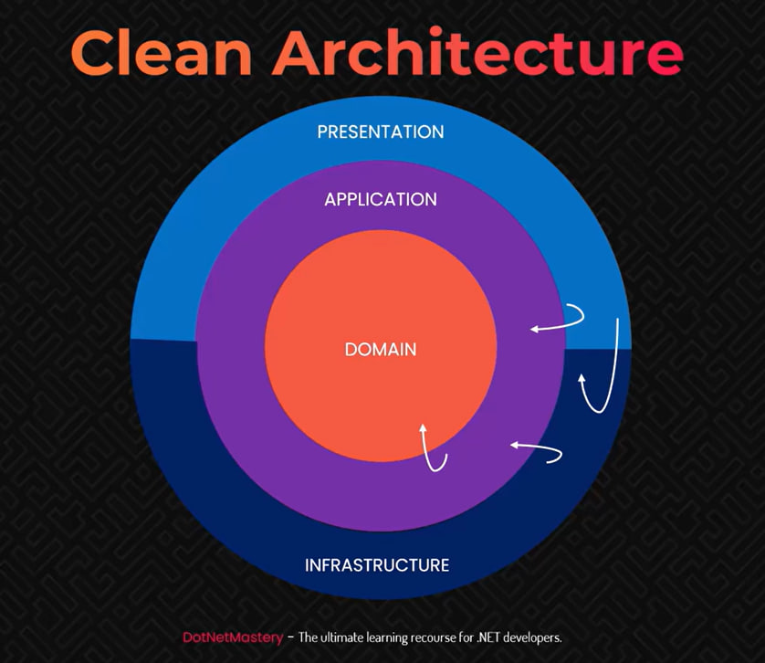

# Meeting Minutes - Single Page Application

A comprehensive meeting minutes management system built with ASP.NET Core 8.0 following Clean Architecture principles. This is a Single Page Application.


## 🖼️Screenshots


### Project Structure

```
MeetingMinutes.Web/          # Presentation Layer (ASP.NET Core MVC)
├── Controllers/             # MVC Controllers
├── Views/                   # Razor Views
├── Models/                  # View Models
├── wwwroot/                 # Static files (CSS, JS, images)
└── Program.cs              # Application entry point

MeetingMinutes.Application/  # Application Layer
├── Services/               # Business logic implementation
└── ServiceInterface/       # Service contracts

MeetingMinutes.Domain/       # Domain Layer
├── Entities/               # Domain entities
└── RepositoryInterfaces/   # Repository contracts

MeetingMinutes.Infrastructure/ # Infrastructure Layer
├── Repositories/           # Data access implementation
└── DBContext/             # Database context (Dapper)

DatabaseQueries/            # Database scripts
└── database_DDL.sql       # Database schema
```

### Technology Stack

- **Framework**: ASP.NET Core 8.0
- **ORM**: Dapper for data access
- **Database**: SQL Server
- **Frontend**: MVC with Razor Views, Bootstrap, jQuery
- **Architecture**: Clean Architecture with Repository Pattern
- **Dependency Injection**: Built-in ASP.NET Core DI

## 📋 Prerequisites

- [.NET 8.0 SDK](https://dotnet.microsoft.com/download/dotnet/8.0)
- [SQL Server](https://www.microsoft.com/en-us/sql-server/sql-server-downloads) (LocalDB, Express, or full version)
- [Visual Studio 2022](https://visualstudio.microsoft.com/) or [VS Code](https://code.visualstudio.com/)

## 🛠️ Installation & Setup

### 1. Clone the Repository
```bash
git clone https://github.com/shefat2002/MeetingMinutes_SPA
cd MeetingMinutes_SPA
```

### 2. Database Setup
```bash
# Execute the database script
sqlcmd -S (localdb)\MSSQLLocalDB -i DatabaseQueries/database_DDL.sql
```

### 3. Configure Connection String
Update the connection string in `MeetingMinutes.Web/appsettings.json`:
```json
{
  "ConnectionStrings": {
    "DefaultConnection": "Server=<Your-Server>;Database=MeetingMinutesDB;Trusted_Connection=true;"
  }
}
```

### 4. Restore Dependencies
```bash
dotnet restore
```

### 5. Build the Solution
```bash
dotnet build
```

### 6. Run the Application
```bash
cd MeetingMinutes.Web
dotnet run
```

The application will be available at `https://localhost:5001` or `http://localhost:5000`.


## 🧪 Development

### 📊 Database Schema

The application uses the following main entities:

- **Corporate_Customer_Tbl**: Corporate customer information
- **Individual_Customer_Tbl**: Individual customer information  
- **Products_Service_Tbl**: Products and services catalog
- **MeetingMinutes_Master_Tbl**: Main meeting records
- **MeetingMinutes_Details_Tbl**: Detailed meeting items and services

### ☑️Project Dependencies

NuGet packages used:
- `Dapper` (2.1.66) - Micro ORM for data access
- `Microsoft.EntityFrameworkCore.SqlServer` (8.0.17) - SQL Server provider
- `Microsoft.AspNetCore.Mvc.NewtonsoftJson` (8.0.17) - JSON serialization
- `Microsoft.jQuery.Unobtrusive.Validation` (4.0.0) - Client-side validation

### 📝 Create Models

Define entity classes in the  `MeetingMinutes.Domain/Entities` folder:

#### Example:
```csharp
public class IndividualCustomer
{
    public int Id { get; set; }
    public string? CustomerName { get; set; }
    public bool IsActive { get; set; }
    public DateTime CreatedDate { get; set; }
}
```

### ⚙️ Configuring Dapper

Added a `DapperDbContext` class in `MeetingMinutes.Infrastructure/DBContext` folder:
  ```csharp
  public class DapperDbContext
  {
     private readonly IConfiguration _configuration;
     private readonly string _connectionString;

     public DapperDbContext(IConfiguration configuration)
     {
        _configuration = configuration;
        _connectionString = _configuration.GetConnectionString("DefaultConnection");
     }

     public IDbConnection CreateConnection() => new SqlConnection(_connectionString);
  }
```
  and Interface `IDbContext`:
  ```csharp
  public interface IDbContext
  {
      IDbConnection CreateConnection();
  }
  ```
Registered DapperDbContext for Dependency Injection  
  In `MeetingMinutes.Web/Program.cs`:
  ```csharp
  builder.Services.AddSingleton<IDbContext, DapperDbContext>();
  ```

### 🗂️ Implement Repository

  Define repository interfaces in `MeetingMinutes.Domain/RepositoryInterfaces`:

#### Example: `IIndividualCustomerRepository`
  ```csharp
  public interface IIndividualCustomerRepository
  {
      Task<IEnumerable<IndividualCustomer>> GetAllIndividualCustomersAsync();
  }
  ```

  Implement the repositories in `MeetingMinutes.Infrastructure/Repositories`:

#### Example: `IndividualCustomerRepository`
  ```csharp
  public class IndividualCustomerRepository : IIndividualCustomerRepository
  {
      private readonly IDbContext _dbContext;
      public IndividualCustomerRepository(IDbContext dbContext)
      {
          _dbContext = dbContext;
      }
      public async Task<IEnumerable<IndividualCustomer>> GetAllIndividualCustomersAsync()
      {
          using var connection = _dbContext.CreateConnection();
          const string sql = "SELECT * FROM Individual_Customer_Tbl  WHERE IsActive = 1";
          var result = await connection.QueryAsync<IndividualCustomer>(sql);
          return result;
      }
  }
  ```

  Register the repository for dependency injection in `MeetingMinutes.Web/Program.cs`:
  #### Example:
  ```csharp
  builder.Services.AddScoped<IIndividualCustomerRepository, IndividualCustomerRepository>();
  ```

  ### 🛎️ Implement Service Layer

  Define service interfaces in `MeetingMinutes.Application/ServiceInterface`:

  #### Example: `ICustomerService`
  ```csharp
  public interface ICustomerService
  {
      Task<IEnumerable<CorporateCustomer>> GetAllCorporateCustomersAsync();
      Task<IEnumerable<IndividualCustomer>> GetAllIndividualCustomersAsync();
  }
  ```

  Implement the service in `MeetingMinutes.Application/Services`:

  #### Example: `CustomerService`
  ```csharp
public class CustomerService : ICustomerService
{
    private readonly ICorporateCustomerRepository _corporateCustomerRepository;
    private readonly IIndividualCustomerRepository _individualCustomerRepository;
    public CustomerService(
        ICorporateCustomerRepository corporateCustomerRepository,
        IIndividualCustomerRepository individualCustomerRepository)
    {
        _corporateCustomerRepository = corporateCustomerRepository;
        _individualCustomerRepository = individualCustomerRepository;
    }
    public async Task<IEnumerable<CorporateCustomer>> GetAllCorporateCustomersAsync()
    {
        return await _corporateCustomerRepository.GetAllCorporateCustomersAsync();
    }
    public async Task<IEnumerable<IndividualCustomer>> GetAllIndividualCustomersAsync()
    {
        return await _individualCustomerRepository.GetAllIndividualCustomersAsync();
    }
}

  ```

  Register the service for dependency injection in `MeetingMinutes.Web/Program.cs`:
  ```csharp
  builder.Services.AddScoped<ICustomerService, CustomerService>();
  ```

  ### 🔗 Project References (Clean Architecture)

  Set up project references to enforce Clean Architecture boundaries:

  - `MeetingMinutes.Web`  
    - Reference: `MeetingMinutes.Application`
  - `MeetingMinutes.Application`  
    - Reference: `MeetingMinutes.Domain`
  - `MeetingMinutes.Infrastructure`  
    - References:  
      - `MeetingMinutes.Domain`
      - `MeetingMinutes.Application` (if needed for implementation)
  - `MeetingMinutes.Domain`  
    - No project references (core business logic only)

  #### Easy way to remember:
  


  